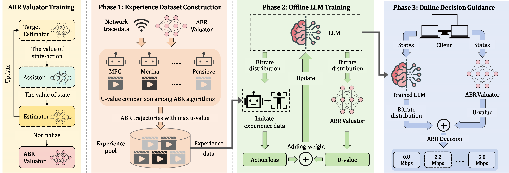

# DQLF
---
DQLF (Decision-Quality-guided LLM Framework) is a general optimization framework that improves LLM-based adaptive bitrate (ABR) streaming by guiding both offline training and online decision making with decision-quality assessment.


# Environment Setup
---
## Environment for u-Pretrain
---
```
python==3.8.10
numpy==1.24.4
stable-baselines3==1.1.0
torch==2.1.0
torchvision==0.16.0
torchaudio==2.1.0
transformers==4.5.1
packaging==21.3
protobuf==3.20.0
```
## Environment for u-NetLLM
---
```
python==3.8.10
torch==2.1.0
numpy==1.22.0
munch==4.0.0
openprompt==1.0.1
transformers==4.34.1
peft==0.6.2
pillow==9.5.0
tflearn==0.5.0
```
## Environment for u-Mamba
---
```
python=3.9.19
accelerate==1.0.0
huggingface-hub==0.30.0
mamba-ssm==2.2.4
munch==4.0.0
numpy==1.22.0
peft==0.6.2
pillow==11.3.0
psutil==7.1.3
safetensors==0.7.0
tokenizers==0.14.1
torch==2.1.0
```
# Code Structure
---
- `Genet`: Source code for Genet.
- `Pensieve`: Source code for Pensieve.
- `Merina`: Source code for Merina.
- `NetLLM`: Source code for NetLLM.
- `Mamba4Net`: Source code for Mamba4Net.
- `u-NetLLM`: Source code for u-NetLLM
  - `artifacts/`: Stores experience pools and result files.
    - `exp_pool/`: Experience pools.
    - `results/`: Experimental results.
  - `data/`: Stores datasets and pre-trained model checkpoints.
    - `traces/`: Bandwidth trace datasets.
    - `videos/`: Video specifications.
    - `ft_plms/`: models for NetLLM.
    - `ft_plms_u/`: models for u-NetLLM.
    - `all_models/`: models of baseline algorithm.
  
  - `baseline_special/`: Source code for running baseline algorithms. 
  
  - `plm_special/`: Source code for u-NetLLM.
    - `data/`: Data processing for LLM adaptation.
    - `models/`: u-NetLLM model implementation.
    - `utils/`: Utility functions.
    - `trainer.py`: Training pipeline for LLM adaptation.
    - `evaluate.py`: Performance evaluation.
    - `test.py`: Testing adapted LLMs.
  - `qcs/`: Utility functions for ABR Valuator.
  - `run_plm_u.py`: Main entry for running u-NetLLM.
- `u-Mamba`: Source code for u-Mamba, structure for u-Mamba is same as u-NetLLM
# Usage
---
## Usage for u-pretrain
---
#### Train
```
python main_iql_pretrain.py --exp-pool exp_pool.pkl
```
## Usage for u-NetLLM
---
To run u-NetLLM, we need to download Llama2-7b. In the following, we will use the Llama2-7b to illustrate the usage of u-NetLLM.
#### Train
```
CUDA_VISIBLE_DEVICES=0,1 python run_plm_u.py --adapt --grad-accum-steps 32 --plm-size base --rank 128 --lr 0.0001 --warmup-steps 2000 --eval-per-epoch 2 --w 10 --plm-type llama --peft-modules q_proj v_proj --target-return-scale 1. --num-epochs 160 --device cuda:0 --device-out cuda:1 --q --normalized_max_return 0.8 --q-scale 4.0 --trace train --exp-pool exp_pool.pkl 
```
#### Test
```
CUDA_VISIBLE_DEVICES=0,1 python run_plm_u.py --test --grad-accum-steps 32 --plm-size base --rank 128 --lr 0.0001 --warmup-steps 2000 --eval-per-epoch 2 --w 10 --plm-type llama --peft-modules q_proj v_proj --target-return-scale 1. --num-epochs 160 --device cuda:0 --device-out cuda:1 --q  --trace test --exp-pool exp_pool.pkl --mdoel-dir model-dir
```
## Usage for u-Mamba
---
#### Train
```
python run_mamba_u.py --adapt --q --grad-accum-steps 32 --plm-size base --rank 128 --lr 0.0001 --warmup-steps 2000 --eval-per-epoch 4 --w 10 --plm-type llama --num-epochs 160 --device cuda:0 --device-out cuda:1 --trace train --exp-pool-path exp_pool.pkl --plm-model-dir plm_model_dir
```
#### Test
```
python run_mamba_u.py --test --q --grad-accum-steps 32 --plm-size base --rank 128 --lr 0.0001 --warmup-steps 2000 --eval-per-epoch 4 --w 10 --plm-type llama --num-epochs 160 --trace test --exp-pool-path exp_pool.pkl --mamba-model-dir model_dir
```
---
Note: This code is released in conjunction with a manuscript currently under peer review. It is provided to substantiate the key findings but is not the final, fully-featured version. We anticipate releasing the complete codebase upon acceptance.
